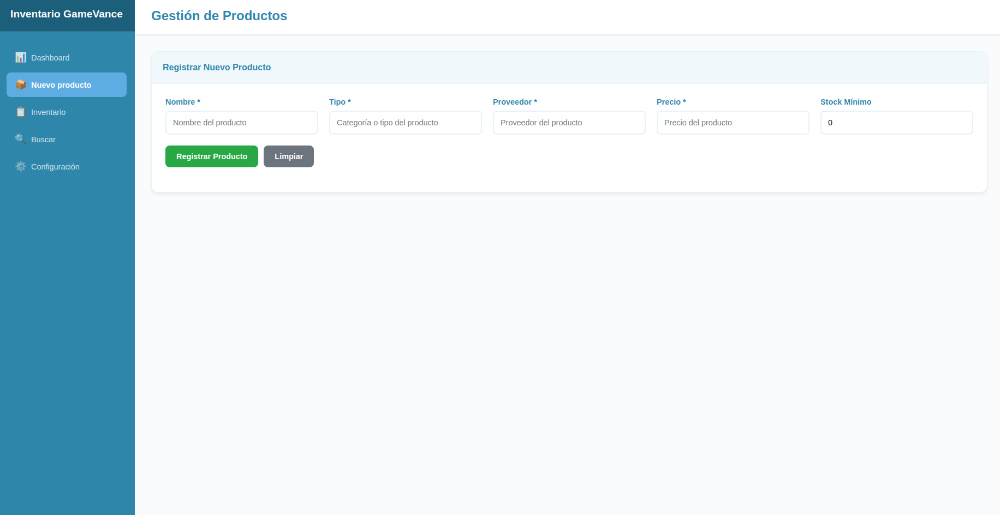

# 🎮 Control de Inventario de Tienda de Videojuegos — *GameVance*

> Aplicación **Full Stack** para la gestión de inventario y ventas de una tienda de videojuegos físicos y consolas.  
> Desarrollada con **Node.js (Express)** en el backend, **MongoDB** para persistencia de datos y un **frontend interactivo** en HTML, CSS y JavaScript.

---

## 🚀 Descripción del Proyecto

**GameVance** permite registrar productos (videojuegos o consolas), controlar el stock disponible, registrar ventas y mostrar alertas de inventario bajo.  
El sistema está dividido en dos partes principales:

- 🧩 **Backend:** API REST construida con **Node.js + Express**, conectada a **MongoDB**, con validaciones, modularización y CORS habilitado.
- 🖥️ **Frontend:** Interfaz web responsive y moderna para interactuar con todas las funcionalidades del backend.

---

## 🕹️ Funcionalidades Principales

### 🔧 Gestión de Productos
- Registrar productos con:
  - `nombre`
  - `tipo` (juego o consola)
  - `precio`
  - `cantidad / stock mínimo`
  - `proveedor`
- Listar, buscar y exportar productos.

### 💸 Ventas e Inventario
- Registrar una venta y descontar stock automáticamente.  
- Validación automática: ❌ no permite vender si no hay stock suficiente.
- Visualización en tiempo real del inventario y alertas de bajo stock.

### 📊 Dashboard
- Muestra estadísticas generales.
- Botones de actualización, exportación y alertas visuales.
- Panel administrativo con opciones para limpiar formularios o reiniciar el sistema.

---

## 🧠 Tecnologías Utilizadas

### 🔙 **Backend**
- Node.js
- Express.js
- MongoDB 
- express-validator
- dotenv (manejo de variables de entorno)
- CORS

### 💅 **Frontend**
- HTML5
- CSS (diseño responsive y moderno)
- JavaScript (DOM + Fetch API)

---

## ⚙️ Arquitectura del Proyecto

```
📦 gamevance/
├── backend/
│   ├── src/
│   │   ├── models/
│   │   ├── routes/
│   │   ├── controllers/
│   │   └── app.js
│   ├── .env
│   ├── package.json
│   └── server.js
│
├── frontend/
│   ├── index.html
│   ├── style.css
│   └── script.js
│
└── README.md
```

---

## ⚡ Configuración del Backend

### 1️⃣ Clonar el repositorio
```bash
git clone https://github.com/usuario/gamevance.git
cd gamevance/backend
```

### 2️⃣ Instalar dependencias
```bash
npm install
```

### 3️⃣ Configurar variables de entorno
Crea un archivo `.env` en la carpeta `backend` con el siguiente contenido:
```
PORT=4000
MONGO_URI=mongodb+srv://<usuario>:<password>@<cluster>.mongodb.net/gamevance
```

### 4️⃣ Iniciar el servidor
```bash
npm start
```

El servidor correrá en [http://localhost:4000](http://localhost:4000).

---

## 💻 Configuración del Frontend

1. Abre la carpeta `frontend/`.
2. Edita el archivo `script.js` y asegúrate de que el `API_URL` coincida con el puerto del backend:

```js
const API_URL = "http://localhost:4000";
```

3. Abre el archivo `index.html` en tu navegador o sirve el proyecto con una extensión como **Live Server**.

---

## 🧪 Pruebas Rápidas

### ✅ Registrar un producto (POST)
```
POST /videojuegos
{
  "nombre": "God of War Ragnarök",
  "tipo": "Juego",
  "precio": 250000,
  "stock": 15,
  "proveedor": "Sony Interactive"
}
```

### 📋 Obtener todos los productos (GET)
```
GET /videojuegos
```

### ⚠️ Validación de stock
- Si un producto tiene `stockActual = 0`, la venta no se puede procesar.
- El frontend mostrará un mensaje visual de **“Stock insuficiente”**.

---

## 🧩 Buenas Prácticas Implementadas

- Código modular (rutas, controladores y modelos separados).
- Validaciones con **express-validator**.
- Variables de entorno con **dotenv**.
- Manejo de errores HTTP y mensajes descriptivos.
- CORS habilitado para permitir comunicación con el frontend.
- Persistencia en MongoDB.

---

## 🎨 Vista del Frontend


> Panel principal del sistema de inventario

---

## 👨‍💻 Autores

**Valentina & Camila**  
Desarrolladoras Full Stack  

---

## 🌟 Conclusión

**GameVance** es una solución moderna, modular y eficiente para la gestión de inventario en tiendas de videojuegos.  
Su diseño intuitivo y su integración con MongoDB hacen que el control del stock y las ventas sea rápido, seguro y visualmente atractivo.
